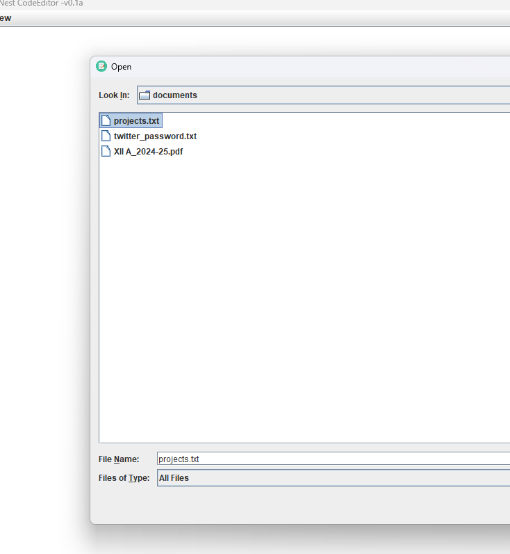
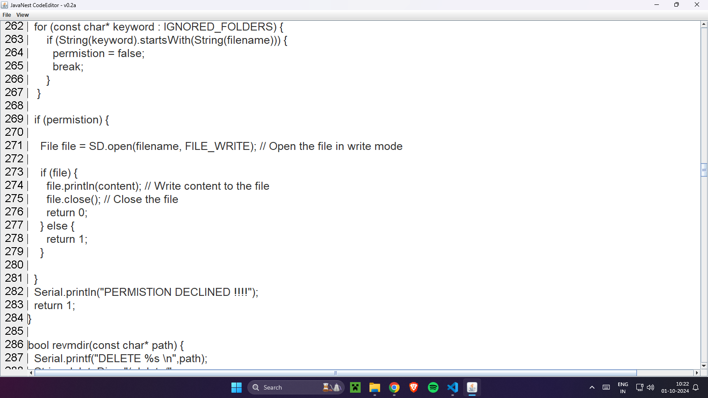

# JavaNest CodeEditor - v0.1a

  

**JavaNest** is a simple code editor built using Java, providing an environment for editing and managing text-based files. This is an early alpha version (`v0.1a`) of the project, currently under active development. The goal of **JavaNest** is to offer a minimal yet customizable code editing experience.

---

## Table of Contents

- [About JavaNest](#about-javanest)
- [Current Features](#current-features)
- [Screenshots](#screenshots)
- [Future Enhancements](#future-enhancements)
- [Development Disclaimer](#development-disclaimer)

---

## About JavaNest

JavaNest takes its name from the concept of Java being the core technology behind the application. The word "Nest" symbolizes a nurturing space where ideas can grow and evolve, just as a nest provides safety and comfort for young birds. This code editor aims to offer a simple, organized environment where developers can work with their source code comfortably.

---

## Current Features

As of version `v0.1a`, the following basic features are available:

- **Basic text editing**: You can open, edit, and save text files with ease.
- **Font size adjustment**: You can increase or decrease the font size through the `View` menu.
- **File metadata**: When saving, the editor adds custom metadata to the file, including the editor version and last modified time.

---

## Screenshots

  

  

_Current screenshots of the editor in its basic form and with font adjustment features._

---

## Future Enhancements

The following features are planned for future versions:

- **Syntax highlighting**: Support for multiple programming languages with color-coded syntax.
- **Line numbering**: Add visible line numbers to assist with code organization.
- **Theme support**: Customize the look and feel of the editor with different color schemes.
- **Auto-completion**: Suggestions for code completion based on the language being used.
- **Real-time syntax checking**: Catch syntax errors as you type.

---

## Development Disclaimer

This is an early **alpha version** (`v0.1a`) of JavaNest CodeEditor, and it is currently in active development. It includes only the basic functionality needed to open, edit, and save files. Expect bugs, performance issues, and incomplete features.

If you encounter any issues or have suggestions for features, feel free to reach out to the author.

---

## License

This project is licensed under the MIT License. See the [LICENSE](LICENSE) file for more details.

## About Me

Self-taught coder | Still Learning | Fluent in Java❤️ & Python | C/C++, Rust, & Basic Web Development | Passionate about Embedded Systems ❤️

### Connect with Me

